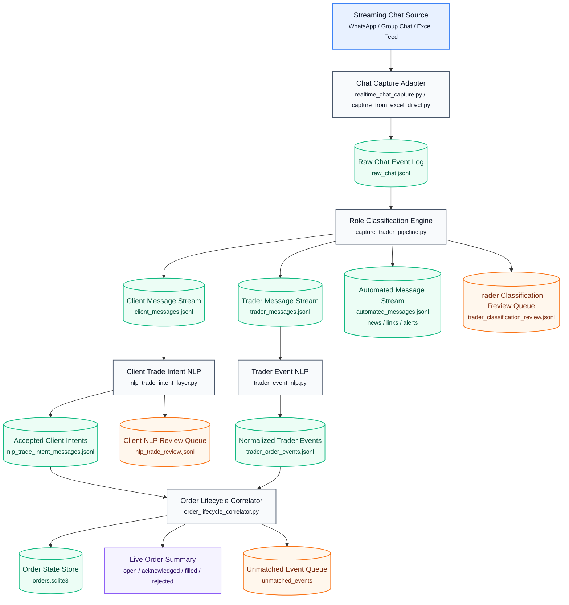

```mermaid
flowchart TD
    %% Ingestion Layer
    A["Streaming Chat Source<br/><small>WhatsApp / Group Chat / Excel Feed</small>"]
    B["Chat Capture Adapter<br/><small>realtime_chat_capture.py / capture_from_excel_direct.py</small>"]
    C[("Raw Chat Event Log<br/><small>raw_chat.jsonl</small>")]

    A --> B --> C

    %% Classification Layer
    D["Role Classification Engine<br/><small>capture_trader_pipeline.py</small>"]
    C --> D

    D --> E1[("Client Message Stream<br/><small>client_messages.jsonl</small>")]
    D --> E2[("Trader Message Stream<br/><small>trader_messages.jsonl</small>")]
    D --> E3[("Automated Message Stream<br/><small>automated_messages.jsonl<br/>news / links / alerts</small>")]
    D --> E4[("Trader Classification Review Queue<br/><small>trader_classification_review.jsonl</small>")]

    %% NLP / Extraction Layer
    E1 --> G["Client Trade Intent NLP<br/><small>nlp_trade_intent_layer.py</small>"]
    E2 --> H["Trader Event NLP<br/><small>trader_event_nlp.py</small>"]

    G --> G1[("Accepted Client Intents<br/><small>nlp_trade_intent_messages.jsonl</small>")]
    G --> G2[("Client NLP Review Queue<br/><small>nlp_trade_review.jsonl</small>")]

    H --> H1[("Normalized Trader Events<br/><small>trader_order_events.jsonl</small>")]

    %% Order Lifecycle Layer
    G1 --> I["Order Lifecycle Correlator<br/><small>order_lifecycle_correlator.py</small>"]
    H1 --> I

    I --> J[("Order State Store<br/><small>orders.sqlite3</small>")]
    I --> K["Live Order Summary<br/><small>open / acknowledged / filled / rejected</small>"]
    I --> L[("Unmatched Event Queue<br/><small>unmatched_events</small>")]

    %% Styling
    classDef source fill:#E8F1FF,stroke:#3B82F6,stroke-width:1.5px,color:#111827;
    classDef processor fill:#F8FAFC,stroke:#475569,stroke-width:1.5px,color:#111827;
    classDef storage fill:#ECFDF5,stroke:#10B981,stroke-width:1.5px,color:#064E3B;
    classDef review fill:#FFF7ED,stroke:#F97316,stroke-width:1.5px,color:#7C2D12;
    classDef output fill:#F5F3FF,stroke:#8B5CF6,stroke-width:1.5px,color:#2E1065;

    class A source;
    class B,D,G,H,I processor;
    class C,E1,E2,E3,G1,H1,J storage;
    class E4,G2,L review;
    class K output;
```
